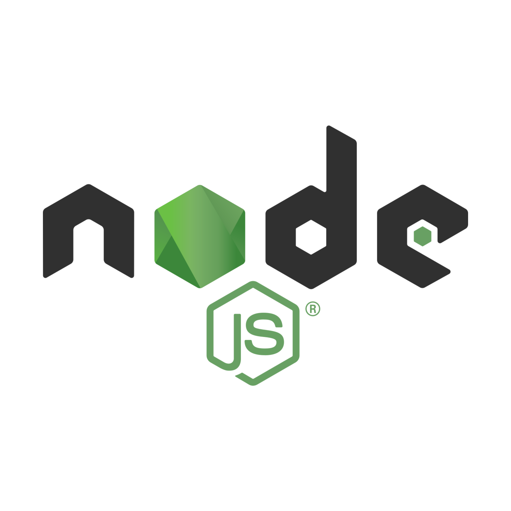
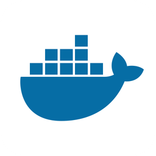

# WiChat EN 1C


[](https://github.com/arquisoft/wichat_en1c/actions)
[](https://sonarcloud.io/summary/new_code?id=Arquisoft_wichat_en1c)
[](https://sonarcloud.io/summary/new_code?id=Arquisoft_wichat_en1c)

WiChat is a web application inspired by the "Saber y Ganar" quiz show. Building upon the general idea of previous year's projects, this version enhances the experience with image-based questions and a conversational hint system powered by a Large Language Model, offering dynamic and interactive assistance.

## Powered by

<div>
  <a href="https://github.com/Arquisoft/wichat_en1c/wiki/Decision-Records#adr-2-frontend-tech">
    
  </a>
  <a href="https://github.com/Arquisoft/wichat_en1c/wiki/Decision-Records#adr-7-web-server-framework">
    
  </a>
  <a href="https://github.com/Arquisoft/wichat_en1c/wiki/Decision-Records#adr-3-backend-tech">
    
  </a>
  <a href="https://github.com/Arquisoft/wichat_en1c/wiki/Decision-Records#adr-4-deployment-tech">
    
  </a>
  <a href="https://github.com/Arquisoft/wichat_en1c/wiki/Decision-Records#adr-1-dbms-tech">
    
  </a>
</div>
<br>

_Each logo has a link to its ADR._

## Team members

- **Héctor Triguero del Río**. UO288992@uniovi.es
- **Fernando Cachon Alonso**. UO295255@uniovi.es
- **Daniel Fernández Cabrero**. UO288499@uniovi.es
- **Umut Dolangac**. UO311846@uniovi.es
- **Diego Martínez Chamorro**. UO294054@uniovi.es

## Architecture

The project architecture is a **non-pure microservices** ([ADR](https://github.com/Arquisoft/wichat_en1c/wiki/Decision-Records#adr-5-arquitectural-pattern)) architecture. The different modules or microservices are:

- **Webapp**. Web application that provides a UI for the application services, accessible through the Gateway Service.
- **Gateway Service**. Service that serves as the barrier between the Internet (and WebApp) and the rest of the services.
- **Auth Service**. Handles the authentication of users.
- **LLM Service**. Handles the communication with the LLM. This service is internal.
- **Game Service**. Handles the game's logic: rounds, time, etc.
- **Questions Service**. Handles generating questions from the WikiData DB.
- **Statistics Service**. Keeps track of the games played by the user and computes statistics about them.

The architecture is classified as **non-pure** because the microservices are interdependent and share a single database. This design choice minimizes code duplication and reduces overall complexity. However, it comes at the expense of reliability and availability, which are not critical priorities for this project.

## Quick start

1. First, clone the project:

   ```sh
   git clone https://github.com/Arquisoft/wichat_en1c.git
   ```

2. Create an `.env` at the root of the project with the following structure:

   ```properties
   LLM_API_KEY=<llm_api_token>
   CRYPT_SECRET=<secret_used_to_encrypt_password>
   JWT_SECRET=<secret_used_to_encrypt&sign_JWTs>
   ```

   > [!IMPORTANT]
   > Note that this file must **NOT** be shared publicly.

3. Launch the application with **Docker Compose** or do a **component-by-component** start.
   - **Docker Compose**:
   ```sh
   docker compose --profile dev up --build
   ```
   - **Component-by-component**:
   ```sh
   docker run -d -p 27017:27017 --name=my-mongo mongo:latest # run Database
   cd <service>
   npm i
   npm start
   ```

## Deployment

For the deployment, we have several options. The first and more flexible is to deploy to a virtual machine using SSH. This will work with any cloud service (or with our own server). Other options include using the container services that all the cloud services provide. This means, deploying our Docker containers directly. Here I am going to use the first approach. I am going to create a virtual machine in a cloud service and after installing docker and docker-compose, deploy our containers there using GitHub Actions and SSH.

### Machine requirements for deployment

The machine for deployment can be created in services like Microsoft Azure or Amazon AWS. These are in general the settings that it must have:

- Linux machine with Ubuntu > 20.04 (the recommended is 24.04).
- Docker installed.
- Open ports for the applications installed (in this case, ports 3000 for the webapp and 8000 for the gateway service).

Once you have the virtual machine created, you can install **Docker** using the following instructions:

```ssh
sudo apt update
sudo apt install apt-transport-https ca-certificates curl software-properties-common
curl -fsSL https://download.docker.com/linux/ubuntu/gpg | sudo apt-key add -
sudo add-apt-repository "deb [arch=amd64] https://download.docker.com/linux/ubuntu focal stable"
sudo apt update
sudo apt install docker-ce
sudo usermod -aG docker ${USER}
```

### Continuous delivery (GitHub Actions)

Once the machine is ready, the application can be deployed manually by transferring the `docker-compose.yml` file to the remote machine and executing it. However, this repository automates the deployment process using **GitHub Actions**. The deployment is triggered when a new release is created, executing the following [workflow](https://raw.githubusercontent.com/arquisoft/wichat_en1c/master/.github/workflows/release.yml).

This workflow ensures that unit tests for each module and end-to-end (e2e) tests are successfully executed before pushing the Docker images and deploying them. This approach prevents deploying versions that fail the tests and makes deployments fast and repeatable.

Please note the GitHub Actions workflow requires three secrets to be configured in the repository:

- `DEPLOY_HOST`: The IP address of the remote machine.
- `DEPLOY_USER`: The username with permissions to execute commands on the remote machine.
- `DEPLOY_KEY`: The private key used to authenticate the user on the remote machine.

This workflow logs into the remote machine, downloads the `docker-compose.yml` file from the repository, and launches the application. Prior steps in the workflow ensure that the Docker images are built and uploaded to the GitHub Packages repository.
